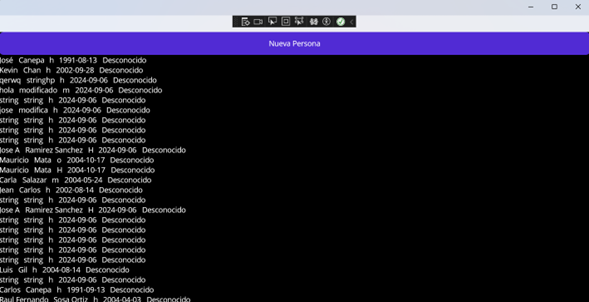

# Proyecto .NET MAUI - DataBiding2

Esta aplicación en .NET MAUI permite la gestión de personas, mostrando una lista obtenida de una API y proporcionando un formulario para agregar nuevos registros.

## Descripción de la Aplicación

El proyecto tiene dos pantallas principales:

1. **MainPage**: Es la pantalla inicial, donde se muestra una lista de personas obtenida a través de una API. Los datos se enlazan mediante una colección observable para reflejar automáticamente cualquier cambio.

   

2. **FormPage**: Contiene un formulario que permite agregar una nueva persona. Una vez completado el formulario y enviada la información, se retorna a `MainPage` donde la lista se actualiza.

   

## Componentes del Proyecto

### Modelo `PersonaModel`

`PersonaModel` representa los datos de una persona y contiene propiedades básicas como nombre, apellido, sexo, fecha de nacimiento, y un identificador de rol. Incluye también una propiedad de solo lectura que interpreta el rol en función del identificador, proporcionando descripciones como "Alumno", "Maestro" o "Administrativo".

### MainPage

`MainPage` es la pantalla principal que muestra la lista de personas. Esta lista se obtiene de una API remota y se actualiza automáticamente cada vez que se agrega una nueva persona. La funcionalidad principal de esta pantalla incluye:
- Cargar datos desde una API al iniciar.
- Usar `ObservableCollection` para enlazar datos a la vista.
- Navegar a `FormPage` para añadir una nueva persona.

### FormPage

`FormPage` contiene un formulario para añadir una persona nueva. La pantalla incluye campos como nombre, apellido, sexo, fecha de nacimiento, y rol. Cuando el usuario guarda la nueva persona:
- Los datos se envían a la API a través de una solicitud HTTP.
- Se retorna automáticamente a `MainPage` donde la nueva entrada se muestra en la lista de personas.

## Funcionalidad del Proyecto

1. **Navegación entre pantallas**: 
   - Desde `MainPage`, el botón "Nueva Persona" permite abrir `FormPage` para ingresar datos.
   - En `FormPage`, el botón "Guardar Persona" guarda los datos y retorna a `MainPage` con la lista actualizada.

2. **Consumo de API**: 
   - `MainPage` realiza una solicitud HTTP a la API configurada para obtener la lista de personas.
   - `FormPage` envía una solicitud HTTP `POST` a la misma API para almacenar nuevos registros.

3. **Enlace de datos**: 
   - `ObservableCollection` se utiliza en `MainPage` para enlazar dinámicamente la lista de personas a la vista, de forma que los cambios se reflejan en tiempo real.

## Configuración del Proyecto

1. Clonar el repositorio del proyecto.
2. Ejecutar la aplicación en un entorno compatible con .NET MAUI.

## Como usar el proyecto

1. Una vez abierto el programa, scroll hacia abajo para ver todos los registros
2. Para agregar registro, click en el botón nueva persona
3. Agregar los datos de la persona como se pide
4. Hacer click en el boton Guardar Persona
5. Revisar y agregarlos registros que se requieran
